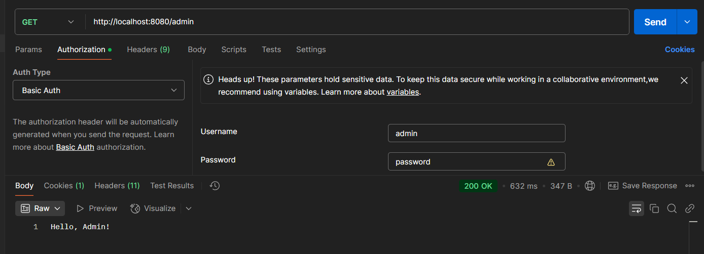
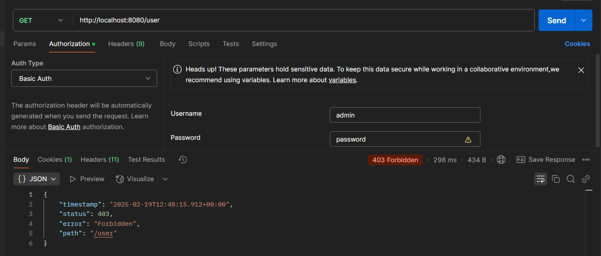
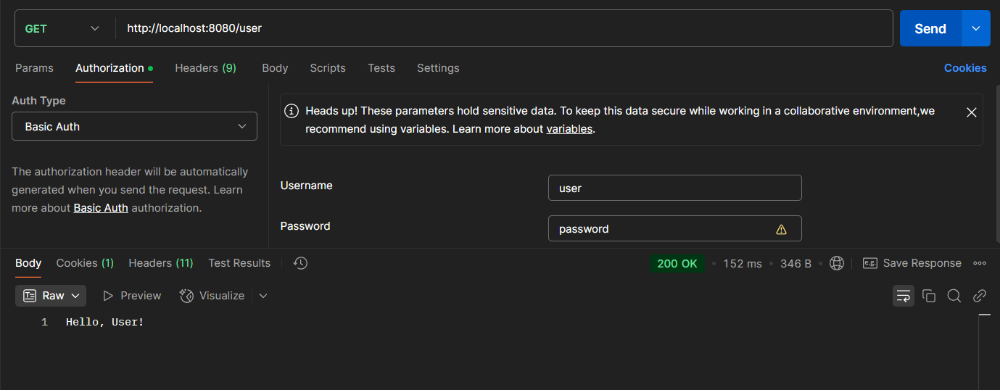
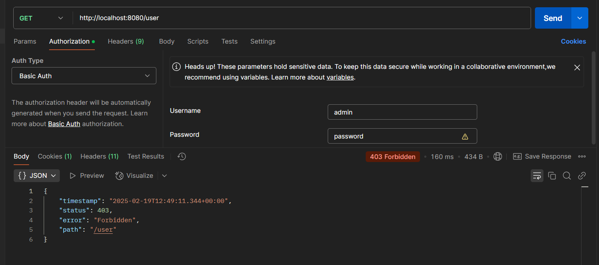
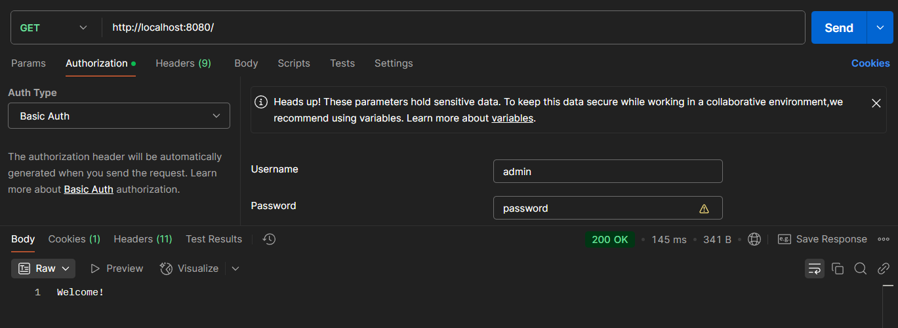
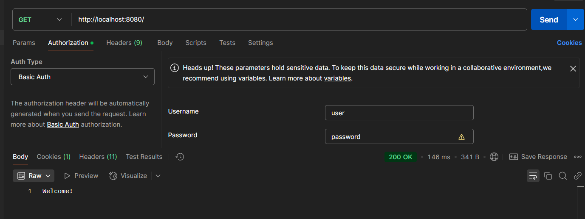
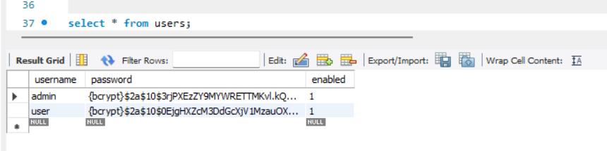
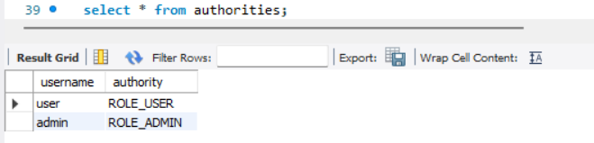

# Using JDBC User details Manager instead Of In-Memory User details manager

## Table of contents

1. [Application Properties](#1-application-properties)
2. [SQL Database With Tables](#2-sql-database-with-tables)
3. [Security Configuration](#3-security-configuration)
4. [Controller Layer](#4-controller-layer)
5. [Outputs](#5-output)

### 1. Application Properties

```properties
spring.application.name=Spring-Security-2
#mysql
spring.datasource.url=jdbc:mysql://localhost:3306/spring_secutity
spring.datasource.username=root
spring.datasource.password=root
#hibernate
spring.jpa.hibernate.ddl-auto=update
spring.jpa.show-sql=true
```

---

### 2. SQL Database With Tables

```
create database spring_secutity;

use spring_secutity;

CREATE TABLE users (
    username VARCHAR(50) PRIMARY KEY,
    password VARCHAR(255) NOT NULL,
    enabled BOOLEAN NOT NULL
);

CREATE TABLE authorities (
    username VARCHAR(50) NOT NULL,
    authority VARCHAR(50) NOT NULL,
    FOREIGN KEY (username) REFERENCES users(username)
);

select * from users;

select * from authorities;
```

---

### 3. Security Configuration

```java
@Configuration
@EnableMethodSecurity
public class SecurityConfig {
    /// datasource for SQL database
    @Autowired
    DataSource dataSource;

    /// security filter chain
    @Bean
    SecurityFilterChain defaultSecurityFilterChain(HttpSecurity http) throws Exception {
        http.authorizeHttpRequests((authorize) -> ((AuthorizeHttpRequestsConfigurer.AuthorizedUrl) authorize.anyRequest()).authenticated()).formLogin(Customizer.withDefaults());

        /// header based login
        http.httpBasic(Customizer.withDefaults());
        return (SecurityFilterChain) http.build();
    }

    /// user details service
    @Bean
    public UserDetailsService userDetailsService() {
        //password encoder
        PasswordEncoder encoder = PasswordEncoderFactories.createDelegatingPasswordEncoder();

        //user
        UserDetails user = User.withUsername("user").password(encoder.encode("password")).roles("USER").build();

        //admin
        UserDetails admin = User.withUsername("admin").password(encoder.encode("password")).roles("ADMIN").build();

        //jdbc based user details manager
        JdbcUserDetailsManager userDetailsManager = new JdbcUserDetailsManager(dataSource);

        //check for user
        if (!userDetailsManager.userExists("user"))
            userDetailsManager.createUser(user);
        //check for admin
        if (!userDetailsManager.userExists("admin"))
            userDetailsManager.createUser(admin);

        return userDetailsManager;
    }
}
```

---

### 4. Controller Layer

```java
@RestController
public class GreetController {

    //allow everyone access
    @GetMapping("/")
    public String greet() {
        return "Welcome!";
    }

    //only for user
    @PreAuthorize("hasRole('USER')")
    @GetMapping("/user")
    public String helloUser() {
        return "Hello, User!";
    }

    //only for admin
    @PreAuthorize("hasRole('ADMIN')")
    @GetMapping("/admin")
    public String helloAdmin() {
        return "Hello, Admin!";
    }
}
```

---

### 5. Output

1. admin 
2. admin but user details 
3. user 
4. user but admin details 
5. home with user details 
6. home with user details 
7. Sql user table 
8. Sql authorities 

---